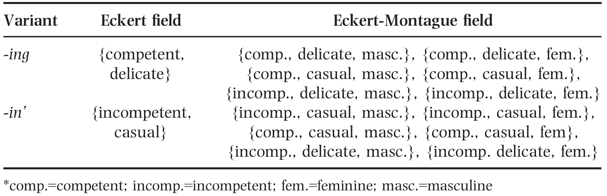

```{r setup, include=FALSE}
options(htmltools.dir.version = FALSE)


library(tidyverse)
theme_set(theme_bw())
library(forcats)
library(scales)
library(knitr)

```

class: center, middle, title-slide

## Social meaning in game-theoretic pragmatics
### (Burnett 2017)


<br />


### Ciyang Qing


```{r, out.height = "80px", echo=FALSE}

```
&nbsp; &nbsp; &nbsp; &nbsp; &nbsp;
```{r, out.height = "80px", echo=FALSE}

```

### ALPS lab meeting (January 24, 2018)


---
# Vanilla RSA 


- Literal listener: $L_0(w \mid m) \propto \Pr(w) \cdot \delta_{w \in [[m]]}$

- Speaker: $S_1(m \mid w) \propto \exp(\alpha \cdot U(m, w))$

- Pragmatic listener: $L_2(w \mid m) \propto \Pr(w) \cdot S_1(m \mid w)$

<br />

(Toy) RSA model for scalar implicature:  
"Mary ate some of the cookies" $\rightsquigarrow$ "Mary didn't eat all of the cookies" 

- Suppose there are 3 cookies in total

- Possible world $w_i$: Mary ate exactly $i$ cookie(s) $(0\leq i \leq 3)$

- Uniform prior $\Pr(w)$

```{r, echo=FALSE}
tb.prior <- data.frame(w0= .25, w1= .25, w2= .25, w3=.25, row.names = "Pr")
knitr::kable(tb.prior, format = 'html')
```


---
# Vanilla RSA: literal listener

Literal listener: $L_0(w \mid m) \propto \Pr(w) \cdot \delta_{w \in [[m]]}$

- Possible messages: NONE, ALL, SOME

- Denotations

  + $[[\text{NONE}]] = \{w_0\}$

  + $[[\text{ALL}]] = \{w_3\}$
  
  + $[[\text{SOME}]] = \{w_1, w_2, w_3\}$
  
- $\delta_{\phi} = 1$ if $\phi$ is true, $0$ otherwise 
  
```{r, echo=FALSE}
tb.delta <- data.frame(w0= c(1, 0, 0), w1= c(0, 0, 1), w2= c(0, 0, 1), w3=c(0, 1, 1), row.names = c("NONE", "ALL", "SOME"))
knitr::kable(tb.delta, format = 'html')
```  


---
# Vanilla RSA: literal listener

Literal listener: $L_0(w \mid m) \propto \Pr(w) \cdot \delta_{w \in [[m]]}$

```{r, echo=FALSE}
tb.l0product <- tb.delta * .25
knitr::kable(tb.l0product, format = 'html')
```  

$\propto$: multiplication by a normalizing constant

- Each row is a probability distribution, i.e., should sum up to 1

- To satisfy this, each cell is divided by the sum of its row

```{r, echo=FALSE}
# normalization by row; should double check
tb.l0 <- tb.l0product / rowSums(tb.l0product)
knitr::kable(tb.l0, format = 'html', digits = 3)

```  

---
# Vanilla RSA: Speaker

Speaker: $S_1(m \mid w) \propto \exp(\alpha \cdot U(m, w))$
  
- $\propto \exp(\alpha \cdot U)$: soft-max function/rule

  + $\alpha$ measures the degree to which the choice is maximizing the utility
  
  + $\alpha = +\infty$: only choose those options that maximize the utility
  
  + $\alpha = 0$: uniform choice
  
- Utilities are relative: adding a constant to $U$ across the board does not change the result, because of $\propto$
  
- $U(m, w) = \ln(L_0(w \mid m)) - C(m)$

  + $\ln(L_0(w \mid m))$: a measure of how close the induced listener's belief is to the speaker's own belief
  
  + $C(m)$ cost of messages, assumed to be $0$


---
# Vanilla RSA: Speaker

```{r, echo=FALSE}
knitr::kable(tb.l0, format = 'html', digits = 3)
```  

$U(m, w) = \ln(L_0(w \mid m)) - C(m)$


```{r, echo=FALSE}
tb.utils <- log(tb.l0)
knitr::kable(tb.utils, format = 'html', digits = 3)
```  

Note the typo in the original paper: it should be $\ln(.333)=$  `r log(.333)` 
---
# Vanilla RSA: Speaker

Let $\alpha = 10$, $\exp(\alpha \cdot U(m, w))$
```{r, echo=FALSE}
par.alpha <- 10
tb.s1product <- exp(par.alpha * tb.utils)
knitr::kable(tb.s1product, format = 'html', digits = 6)
```  

$S_1(m \mid w) \propto \exp(\alpha \cdot U(m, w))$

- Normalizing by column

```{r, echo=FALSE}
tb.s1 <- mutate_all(tb.s1product, function(v) v/sum(v))
row.names(tb.s1) <- c("NONE", "ALL", "SOME")
knitr::kable(tb.s1, format = 'html', digits = 6)
```  


---
# Vanilla RSA: Pragmatic speaker

Pragmatic listener: $L_2(w \mid m) \propto \Pr(w) \cdot S_1(m \mid w)$

```{r, echo=FALSE}
tb.l2product <- tb.s1 * .25
knitr::kable(tb.l2product, format = 'html', digits = 6)
```  

$\propto$: Normalizing by row

```{r, echo=FALSE}
# normalization by row; should double check
tb.l2 <- tb.l2product / rowSums(tb.l2product)
knitr::kable(tb.l2, format = 'html', digits = 6)

```  

---
# Social meaning

- I am working on my paper (-ing)

- I am workin' on my paper (-in')


The -ing variant

- educated, more articulate, gay (for one speaker)  (Campbell-Kibler 2006, 2007, 2008)

- formality, non-physical masculinity/non-masculinity, pro-establishment 


The -in' variant

- redneck  (Campbell-Kibler 2006, 2007, 2008)

- casualness, physical masculinity, anti-establishment (Kiesling 1998)


Indexing relation (association)

---
# Empirical phenomena

Burnett (2017, p254)

- Listeners make judgments about the properties that characterize speakers based
on the linguistic forms that they use

- Social interpretation is crucially constrained by listener prior beliefs

- Speakers strategically exploit listeners’ interpretation
processes to communicate properties about themselves and, in doing so,
construct their identities

- Speakers are sensitive to what
their interlocutors think about them, and that these expectations can influence
which linguistic forms they use  (e.g., Gratton 2016)

---
# Gratton 2016

Group interviews with non-binary individuals

- Gender at birth: female (Flynn), male (Casey)

- Place: queer-friendly, public coffee shop


Use of -ing vs -in' variants

- Queer-friendly: No significant difference (44% -ing for Flynn and 58% for Casey)

- Public: 20% -ing for Flynn and 89% for Casey


---
# Gratton 2016

Gratton (2016: 6): The individuals in this community believe that 

- in queer environments
  + they can be read as non-normative quite easily

  + they do not need to consciously worry about their gender presentation. 
  
- in non-queer public contexts

  + individuals whom they encounter in non-queer public spaces will pre-suppose a
binary gender based mainly on their physiological characteristics. 

  + In order to present a non-binary or non-normative gender identity, they must distance
themselves from the gender which is presumed, i.e., their gender-assigned-at-birth 
  
  + by utilizing resources which resist the gender norms associated with their
respective gender-assigned-at-birth

---
# Burnett's (2017) RSA model

Literal listener: $L_0(w \mid m) \propto \Pr(w) \cdot \delta_{w \in [[m]]}$

- Two messages: -ing and -in'

Worlds? $[[\cdot]]$?

- Assume relevant properties are $\{$competent, incompetent, casual, delicate, masculine, feminine $\}$

- A world/persona is a maximal set of ideologically compatible properties

```{r}
personae <- c("{competent, casual, masculine}", 
              "{competent, casual, feminine}", 
              "{competent, delicate, masculine}", 
              "{competent, delicate, feminine}", 
              "{incompetent, casual, masculine}", 
              "{incompetent, casual, feminine}", 
              "{incompetent, delicate, masculine}", 
              "{incompetent, delicate, feminine}")
```  

Design choice: which properties to choose? (Discussion later)

---
# Indexical fields

Burnett (2017, p257): 

"In Third Wave variation theory, individual variants have meaning that goes
beyond their truth conditional meaning. In particular, variants index sets of
properties/stances, called their **indexical field** (Eckert 2008)."


- Eckert indexical fields for (ING)

```{r, echo=FALSE}
tb.eckert <- data.frame(Variant = c("-ing", "-in"), 
                        Eckert.Field = c("{competent, delicate}", "{incompetent, casual}"))
knitr::kable(tb.eckert, format = 'html')
```

- Design choice: which properties to assign to Eckert indexical field? 
Why not assign masculinity to -ing? (Discussion later)

- Eckert indexical fields are interpreted **disjunctively**

  + Derive $[[m]]$ based on $\text{EF}(m)$
  
  + $[[m]] = \{w \mid w \cap \text{EF}(m) \neq \emptyset\}$


---
# Eckert-Montague fields

$[[m]] = \{w \mid w \cap \text{EF}(m) \neq \emptyset\}$

.center[
```{r, out.height = "450px", echo=FALSE}

```
]


---
# Flynn, public, prior

```{r, echo=FALSE}
tb.flprior <- data.frame(Persona = personae, Pr = c(.1, .1, .05, .25, .1, .1, .05, .25))
knitr::kable(tb.flprior, format = 'html')
```

Design choice: prior (discussion later); critical assumptions 

- prior mostly (.7) on feminine personae (due to appearance)

- correlations between properties based on general stereotypes

---
# Flynn, public, literal listener, -ing

Literal listener: $L_0(w \mid m) \propto \Pr(w) \cdot \delta_{w \in [[m]]}$


```{r, echo=FALSE}
knitr::kable(tb.eckert, format = 'html')
```  

```{r, echo=FALSE}
tb.l0ing <- tb.flprior %>% 
  mutate(delta.ing = c(1, 1, 1, 1, 0 , 0, 1, 1)) 
knitr::kable(tb.l0ing, format = 'html')
```  

---
# Flynn, public, literal listener, -ing

Literal listener: $L_0(w \mid m) \propto \Pr(w) \cdot \delta_{w \in [[m]]}$

```{r, echo=FALSE}
knitr::kable(tb.eckert, format = 'html')
```  

```{r, echo=FALSE}
tb.l0ing <- tb.flprior %>% 
  mutate(delta.ing = c(1, 1, 1, 1, 0 , 0, 1, 1)) %>%
  mutate(product.ing = Pr * delta.ing)
knitr::kable(tb.l0ing, format = 'html')
```  

---
# Flynn, public, literal listener, -ing

Literal listener: $L_0(w \mid m) \propto \Pr(w) \cdot \delta_{w \in [[m]]}$

```{r, echo=FALSE}
knitr::kable(tb.eckert, format = 'html')
```  

```{r, echo=FALSE}
tb.l0ing <- tb.flprior %>% 
  mutate(delta.ing = c(1, 1, 1, 1, 0 , 0, 1, 1)) %>%
  mutate(product.ing = Pr * delta.ing) %>%
  mutate(L0.ing = product.ing/sum(product.ing))
knitr::kable(tb.l0ing, format = 'html')
```  

---
# Flynn, public, literal listener, -in'

Literal listener: $L_0(w \mid m) \propto \Pr(w) \cdot \delta_{w \in [[m]]}$

```{r, echo=FALSE}
knitr::kable(tb.eckert, format = 'html')
```  

```{r, echo=FALSE}
tb.l0in <- tb.flprior %>% 
  mutate(delta.in = c(1, 1, 0, 0, 1, 1, 1, 1)) %>%
  mutate(product.in = Pr * delta.in) %>%
  mutate(L0.in = product.in/sum(product.in))
knitr::kable(tb.l0in, format = 'html')
```  

---
# Flynn, public, Speaker

Speaker: $S_1(m \mid w) \propto \exp(\alpha \cdot U(w, m)))$

```{r, echo=FALSE, warning=FALSE, message=FALSE}
tb.s1flynnPub <- tb.l0ing %>% 
  select(Persona, L0.ing) %>%
  mutate(Util.ing = log(L0.ing)) %>%
  left_join(select(tb.l0in, Persona, L0.in)) %>%
  mutate(Util.in = log(L0.in))
knitr::kable(tb.s1flynnPub, format = 'html')
```  

Suppose Flynn wants to convey {competent, casual, masculine}  (1st row)

- Utility of -in' $(-1.946)$ is higher than -ing $(-2.079)$

- Let $\alpha = 10$, the production probability of -in' is about $.79$

---
# Flynn, public, Speaker

Speaker: $S_1(m \mid w) \propto \exp(\alpha \cdot U(w, m)))$

```{r, echo=FALSE, warning=FALSE, message=FALSE}

SoftMaxChooseFirstAmongTwo <- function(u1, u2, par.alpha = 10){
  v <- cbind(u1, u2) 
  m <- exp(par.alpha * v)
  return((m / rowSums(m))[,1])
}
tb.s1flynnPub <- tb.l0ing %>% 
  select(Persona, L0.ing) %>%
  mutate(Util.ing = log(L0.ing)) %>%
  left_join(select(tb.l0in, Persona, L0.in)) %>%
  mutate(Util.in = log(L0.in)) %>%
  mutate(S1.in = SoftMaxChooseFirstAmongTwo(Util.in, Util.ing))
knitr::kable(tb.s1flynnPub, format = 'html', digits = 3)
```  

Note how the production probabilities are the same for the non-0/1 cases

- This is because the relative informativity of -ing/-in' is the same as long as both are true

- Good/bad prediction? (Discuss)

---
# Casey, public, prior

```{r, echo=FALSE}
tb.csprior <- data.frame(Persona = personae, Pr = c(.25, .05, .1, .1, .25, .05, .1, .1))
knitr::kable(tb.csprior, format = 'html')
```

---
# Flynn, queer-friendly, prior

```{r, echo=FALSE}
tb.flqueerprior <- data.frame(Persona = personae, Pr = c(.79, .01, .01, .05, .05, .01, .01, .05))
knitr::kable(tb.flqueerprior, format = 'html')
```

The desired persona {competent, casual, masculine} already has a high prior

---
# Flynn, queer friendly, literal listener, -ing

Literal listener: $L_0(w \mid m) \propto \Pr(w) \cdot \delta_{w \in [[m]]}$

```{r, echo=FALSE}
knitr::kable(tb.eckert, format = 'html')
```  

```{r, echo=FALSE}
tb.l0ingqueer <- tb.flqueerprior %>% 
  mutate(delta.ing = c(1, 1, 1, 1, 0 , 0, 1, 1)) %>%
  mutate(product.ing = Pr * delta.ing) %>%
  mutate(L0.ing = product.ing/sum(product.ing))
knitr::kable(tb.l0ingqueer, format = 'html')
```  

---
# Flynn, queer friendly, literal listener, -in'

Literal listener: $L_0(w \mid m) \propto \Pr(w) \cdot \delta_{w \in [[m]]}$

```{r, echo=FALSE}
knitr::kable(tb.eckert, format = 'html')
```  

```{r, echo=FALSE}
tb.l0inqueer <- tb.flqueerprior %>% 
  mutate(delta.in = c(1, 1, 0, 0, 1, 1, 1, 1)) %>%
  mutate(product.in = Pr * delta.in) %>%
  mutate(L0.in = product.in/sum(product.in))
knitr::kable(tb.l0inqueer, format = 'html')
```  

---
# Flynn, queer friendly, Speaker

Speaker: $S_1(m \mid w) \propto \exp(\alpha \cdot U(w, m)))$

```{r, echo=FALSE, warning=FALSE, message=FALSE}
tb.s1flynnqueer <- tb.l0ingqueer %>%
  select(Persona, Pr, L0.ing) %>%
  mutate(Util.ing = log(L0.ing)) %>%
  left_join(select(tb.l0inqueer, Persona, L0.in)) %>%
  mutate(Util.in = log(L0.in)) %>%
  mutate(S1.in = SoftMaxChooseFirstAmongTwo(Util.in, Util.ing))
knitr::kable(tb.s1flynnqueer, format = 'html', digits = 3)
```  

Prediction is actually driven by the fact that competent delicate personae and incompetent casual personae have 
 the same total prior.

- Good/bad prediction? (Discuss)

---
# General discussion

- RSA/game-theoretic pragmatics is a powerful framework

- It has a lot of potential in analyzing social meaning

- But, specific models/analyses need to be carefully evaluated both conceptually and empirically

  + Worlds?
  
  + Prior
  
  + $[[\cdot]]$
  
---
# Starting with literal speaker

Literal listener: $L_0(w \mid m) \propto \Pr(w) \cdot \delta_{w \in [[m]]}$

- I think it is particularly problematic to treat indexation as denotation $[[\cdot]]$

- Proposal: for social meanings, start with a literal speaker

  + $L_0(w \mid m) \propto \Pr(w) \cdot S_0(m \mid w)$
  
  + Difference between truth-conditional and indexical meanings: whether or not a sigmoid function is applied to S_0

